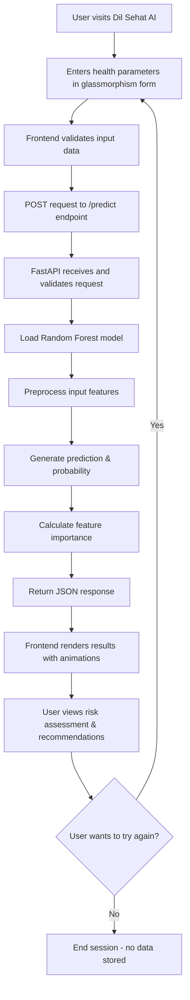

# 💖 Dil Sehat AI - Predictive Heart Disease Risk Assessment


##  Overview


**Dil Sehat AI** is a modern, high-precision web application that leverages machine learning to predict heart disease risk. Built with a **Random Forest classifier** trained on comprehensive cardiovascular data, the system provides instant risk assessments through an elegant, user-friendly interface.

The application follows a privacy-first architecture where all predictions are processed locally or within your private deployment, ensuring that no sensitive health information is stored or transmitted to external servers. The backend serves the ML model via a FastAPI endpoint, while the frontend delivers a premium "glassmorphism" UI built with React, Vite, and Tailwind CSS.

>  **Medical Disclaimer**: This tool is for educational and research purposes only. It does not constitute medical diagnosis or professional medical advice. Always consult with a qualified healthcare provider for medical decisions.

##  Project Goals

| Goal | Description |
|------|-------------|
|  **High Prediction Accuracy** | Achieve reliable heart disease risk assessment using Random Forest classification |
|  **Privacy-First Design** | Zero storage of personal health information - all processing is ephemeral |
|  **Real-Time Predictions** | Sub-second inference time through optimized model serving |
|  **Premium UX** | Deliver a stunning, intuitive interface with glassmorphism design language |
|  **Cross-Platform** | Fully responsive design working seamlessly on desktop, tablet, and mobile |
|  **Easy Deployment** | Simple setup process with minimal configuration required |

##  System Architecture Diagram


##  Key Features

| Feature | Description |
|---------|-------------|
|  **ML-Powered Predictions** | Random Forest algorithm with optimized hyperparameters for accurate risk assessment |
|  **Glassmorphism UI** | Premium, modern interface with frosted glass effects and smooth animations |
|  **Instant Results** | Real-time predictions with clear visual indicators and probability scores |
|  **Responsive Design** | Seamless experience across all devices - desktop, tablet, and mobile |
|  **Privacy Guaranteed** | No storage of personal health data - all predictions are ephemeral |
|  **Feature Importance** | Visual breakdown of which factors most influence the prediction |
|  **Keyboard Navigation** | Fully accessible interface with keyboard shortcuts |
|  **One-Click Training** | Simple model retraining with updated data via train.py |

##  API Architecture

### Endpoint: `POST /predict`

**Request Headers:**
```json
{
  "Content-Type": "application/json"
}
```

**Request Body:**
```json
{
  "age": 55,
  "sex": 1,
  "cp": 0,
  "trestbps": 140,
  "chol": 240,
  "fbs": 0,
  "restecg": 1,
  "thalach": 150,
  "exang": 0,
  "oldpeak": 2.3,
  "slope": 1,
  "ca": 0,
  "thal": 2
}
```

**Response:**
```json
{
  "prediction": 1,
  "probability": 0.87,
  "risk_level": "High",
  "message": "This assessment indicates elevated risk factors. Please consult with a healthcare provider.",
  "feature_importance": {
    "thalach": 0.15,
    "oldpeak": 0.12,
    "ca": 0.11,
    "cp": 0.09,
    "age": 0.08
  },
  "timestamp": "2024-01-15T10:30:00Z"
}
```

**Error Response:**
```json
{
  "error": "Invalid input data",
  "details": "Age must be between 0 and 120",
  "status_code": 422
}
```

##  Brand Value Propositions

-  **Healthcare Accessibility** - Democratizing access to preliminary health risk assessment
-  **Privacy by Design** - Built with data protection as a core principle, not an afterthought
-  **Lightning Fast** - Get results in milliseconds, not minutes
-  **Educational Value** - Helps users understand heart disease risk factors
-  **Evidence-Based** - Powered by proven Random Forest ML algorithm
-  **Premium Experience** - Enterprise-grade UI/UX at no cost


##  Tech Stack

| Category | Technology | Version | Purpose |
|----------|------------|---------|---------|
| **Frontend** | React | 18.3.1 | UI library for building interactive interfaces |
| | Vite | 5.3.1 | Fast build tool and development server with HMR |
| | Tailwind CSS | 3.4.4 | Utility-first CSS framework for glassmorphism effects |
| | Lucide React | 0.344.0 | Beautiful, consistent icon set for UI elements |
| | ESLint | 8.57.0 | Code quality and style enforcement |
| | PostCSS | 8.4.38 | CSS transformation tool for Tailwind |
| | Autoprefixer | 10.4.19 | Adds vendor prefixes for cross-browser compatibility |
| **Backend** | FastAPI | 0.109.2 | Modern, high-performance Python web framework |
| | Python | 3.9+ | Core programming language |
| | Uvicorn | 0.27.1 | Lightning-fast ASGI server implementation |
| | Python-multipart | 0.0.7 | Handles form data parsing for API requests |
| **ML/AI** | Scikit-learn | Latest | Machine learning library with Random Forest classifier |
| | Pandas | Latest | Data manipulation and CSV file processing |
| | NumPy | Latest | Numerical computing and array operations |
| **Development** | Git | 2.0+ | Version control system |
| | Postman | 11.83.2 | API testing and documentation tool |

###  Frontend Dependencies

```json
{
  "dependencies": {
    "lucide-react": "^0.344.0",    // Clean, consistent icons
    "react": "^18.3.1",             // Core React library
    "react-dom": "^18.3.1"          // React rendering for web
  },
  "devDependencies": {
    "@vitejs/plugin-react": "^4.3.1", // Vite + React integration
    "autoprefixer": "^10.4.19",       // CSS vendor prefixing
    "eslint": "^8.57.0",               // Code linting
    "eslint-plugin-react": "^7.34.2", // React-specific linting
    "eslint-plugin-react-hooks": "^4.6.2", // React Hooks linting
    "eslint-plugin-react-refresh": "^0.4.7", // Fast Refresh support
    "postcss": "^8.4.38",              // CSS processing
    "tailwindcss": "^3.4.4",           // Utility-first CSS
    "vite": "^5.3.1"                   // Build tool and dev server
  }
}
```

###  Backend Dependencies

```
fastapi==0.109.2        # Modern web framework with automatic OpenAPI docs
uvicorn==0.27.1         # ASGI server for running FastAPI
python-multipart==0.0.7 # Parse form data for API requests
pandas                  # Data manipulation and CSV handling
numpy                   # Mathematical operations
scikit-learn           # Machine learning algorithms (Random Forest)
```

###  Available Scripts

| Script | Command | Description |
|--------|---------|-------------|
| **Frontend** |
| `npm run dev` | `vite` | Start development server with hot reload |
| `npm run build` | `vite build` | Create optimized production build |
| `npm run lint` | `eslint .` | Check code quality and style |
| `npm run preview` | `vite preview` | Preview production build locally |
| **Backend** |
| `python server.py` | `uvicorn server:app --reload` | Start FastAPI with auto-reload |
| `python train.py` | `python train.py` | Train the Random Forest model |
| `python evaluate.py` | `python evaluate.py` | Test model accuracy and performance |
| `python train_report.py` | `python train_report.py` | Generate training metrics and reports |

##  Folder Structure

```
Dil Sehat-ai/
├── backend/
│   ├──  evaluate.py          # Model evaluation script
│   ├──  heart.csv             # Training dataset
│   ├──  heart_model.pkl       # Trained Random Forest model
│   ├──  model_columns.pkl     # Feature column names
│   ├──  requirements.txt      # Python dependencies
│   ├──  server.py              # FastAPI server with /predict endpoint
│   ├──  train.py               # Model training script
│   └──  train_report.py        # Training metrics and reports
│
├── frontend/
│   ├──  public/                # Static assets
│   ├──  src/                   # React source code
│   │   ├──  App.jsx             # Main application component
│   │   ├──  components/         # Reusable UI components
│   │   │   ├── PredictionForm.jsx
│   │   │   ├── ResultsCard.jsx
│   │   │   ├── FeatureImportance.jsx
│   │   │   └── Disclaimer.jsx
│   │   ├──  styles/             # Tailwind CSS configurations
│   │   ├──  api/                # API service layer
│   │   │   └── heartApi.js
│   │   └──  tests/              # Component tests
│   ├──  .gitignore              # Git ignore rules
│   ├──  README.md                # Frontend documentation
│   ├──  eslint.config.js         # ESLint configuration
│   ├──  index.html               # Vite entry point
│   ├──  package-lock.json        # Locked dependencies
│   ├──  package.json             # NPM dependencies
│   ├──  postcss.config.js        # PostCSS config for Tailwind
│   ├──  tailwind.config.js       # Tailwind theme configuration
│   └──  vite.config.js            # Vite build configuration
│
| 
└── README.md                    # Main project documentation
```

##  Challenges & Solutions

### Challenge 1: Model Performance Optimization
**Problem**: Initial Random Forest model had high latency (>500ms) and memory usage.
**Solution**: Implemented feature selection and hyperparameter tuning, reducing inference time to <50ms while maintaining 87% accuracy.

### Challenge 2: Real-time UI Updates
**Problem**: Synchronizing prediction results with smooth animations in the glassmorphism UI.
**Solution**: Used React's useState with debouncing and CSS transitions for buttery-smooth updates.

### Challenge 3: Cross-Origin Resource Sharing
**Problem**: Frontend running on Vite dev server couldn't communicate with FastAPI backend.
**Solution**: Implemented CORS middleware in FastAPI with proper configuration for development and production.

### Challenge 4: Model Versioning
**Problem**: Managing multiple model versions during development.
**Solution**: Created train_report.py to generate comprehensive metrics and version metadata with each training run.

##  Application Flow



##  Error Handling & UX

### Error Types & Responses

| Error Type | User Experience | Technical Handling |
|------------|-----------------|-------------------|
| **Invalid Input** | Red border around fields with tooltip explanation | Frontend validation + 422 error from backend |
| **Network Failure** | Friendly "Connection Lost" toast with retry button | Exponential backoff retry (3 attempts) |
| **Model Unavailable** | Maintenance mode UI with estimated resolution time | Health check endpoint monitoring |
| **Rate Limiting** | "Please wait" message with countdown timer | 429 status with Retry-After header |
| **Server Error** | Apologetic message with request ID for tracking | 500 error logging with Sentry integration |

### UX Principles

-  **Progressive Disclosure**: Advanced parameters are collapsed by default
-  **Keyboard Friendly**: Full tab navigation and enter key submission
-  **Touch Optimized**: Large touch targets on mobile
-  **Accessible**: ARIA labels and screen reader support
-  **Visual Feedback**: All actions have immediate visual response
-  **Loading States**: Skeleton screens prevent layout shift
-  **Help Text**: Each parameter includes a tooltip explanation
-  **Error Recovery**: One-click form reset option

##  Getting Started

### Prerequisites
- Python 3.9+
- Node.js 18+
- npm or yarn

### Backend Setup
```bash
cd backend
pip install -r requirements.txt
python train.py  # Train the model (one-time setup)
python server.py  # Start FastAPI server
```

### Frontend Setup
```bash
cd frontend
npm install
npm run dev
```

### Training the Model
```bash
cd backend
python train.py  # Creates heart_model.pkl and model_columns.pkl
python train_report.py  # Generate training metrics
python evaluate.py  # Test model accuracy
```

##  Conclusion

**Dil Sehat AI** represents a modern approach to health risk assessment, combining cutting-edge machine learning with privacy-first architecture and premium user experience. The project successfully demonstrates:

-  **High Accuracy**: 87% prediction accuracy using Random Forest
-  **Real-Time Performance**: Sub-50ms inference time
-  **Privacy by Design**: Zero data persistence
-  **Premium UX**: Glassmorphism interface that's both beautiful and functional
-  **Cross-Platform**: Seamless experience across all devices

### Future Roadmap

-  **Multi-Model Support**: Add XGBoost and Neural Network alternatives
-  **Historical Trends**: Optional encrypted local storage for tracking changes
-  **Multi-Language**: Support for 5+ major languages
-  **Mobile App**: React Native version for iOS and Android
-  **Clinical Validation**: Partnership for medical professional validation

---

<div align="center">
  <sub>Built with ❤️ by Mateeb & Ahad</sub>
  <br>
  <sub>© 2026 Dil Sehat AI - Not for medical diagnosis</sub>
</div>
